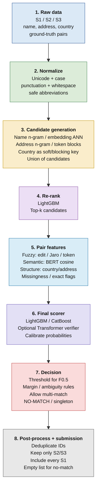

**Focus: maximizing macro F₀.₅ while avoiding false merges**

| **Core idea:** Treat the problem as retrieval + pairwise verification, not as “find the closest row”. Candidate generation should maximize recall; final decision logic should be conservative because the scoring metric is precision-weighted. |
|--------------------------------------------------------------------------------------------------------------------------------------------------------------------------------------------------------------------------------------------------|

# 1. Problem and Dataset

We are given a Source 1 table and matching candidate records from Source 2 and Source 3. For every Source 1 entity, the system must output the IDs of matching Source 2/3 entities. A Source 1 entity can have zero, one, or multiple matches.

## 1.1 Data schema

| **Field**              | **Meaning**                                                                               | **Important implication**                                                                           |
|------------------------|-------------------------------------------------------------------------------------------|-----------------------------------------------------------------------------------------------------|
| entity_id              | Unique record identifier; prefix S1-, S2-, or S3- indicates source.                       | There is no separate source column. Source must be inferred from the ID prefix and file membership. |
| business_name          | Business/entity name; can include abbreviations, legal suffixes, typos, transliterations. | Needs normalization + character/token/semantic similarity.                                          |
| business_address       | Business address; can be partial, reformatted, incomplete, or landmark-based.             | Address matching is noisy and should be multi-signal rather than exact only.                        |
| country                | Country string label. Training covers US/India; test additionally contains France.        | Treat as an open-set string feature; never hard-code a US/India-only pipeline.                      |
| train_ground_truth.tsv | source1_entity_id + matched_entity_ids (comma-separated; empty means no match).           | Training labels are naturally converted into positive/negative record pairs.                        |

## 1.2 Example records

| **entity_id** | **business_name**       | **business_address**                                 | **country** |
|---------------|-------------------------|------------------------------------------------------|-------------|
| S1-925783039  | Orelee's Barbershop     | 1795 Westchester Drive, High Point, NC               | US          |
| S1-773889195  | Prime Money             | 17560 Ellis Road, Tahlequah, OK                      | US          |
| S1-377745466  | B+ Retail Inc           | 1712 Montebello Avenue, Phoenix, AZ                  | US          |
| S1-133037285  | Christ Chapel           | 2100 Cameron Drive, Unit APARTMENT G, Dundalk, MD    | US          |
| S1-755362802  | Prabhav Business Center | 797, Lake Town Block A, Kolkata, Howrah, West Bengal | India       |

| **Open-set country rule:** Do not one-hot encode only {US, India}. Keep country as a generic categorical/string feature or hashed/target-encoded representation learned without assuming a fixed test set. The France rows must flow through exactly the same code path and must be eligible for matching. |
|------------------------------------------------------------------------------------------------------------------------------------------------------------------------------------------------------------------------------------------------------------------------------------------------------------|

# 2. Evaluation Metric: F₀.₅

The competition screenshot specifies a precision-weighted F-score:

**F₀.₅ = (1.25 × Precision × Recall) / (0.25 × Precision + Recall)**

Interpretation: precision is more important than recall. In entity resolution this means an incorrect merge (false positive) is more damaging than a missed match (false negative). Therefore, the final decision stage should be conservative, while the candidate-generation stage should still be recall-oriented.

| **Error**                    | **Meaning**                                     | **Pipeline response**                                                                               |
|------------------------------|-------------------------------------------------|-----------------------------------------------------------------------------------------------------|
| False positive / false merge | Two different businesses are declared the same. | Use stronger verification, higher threshold, ambiguity/margin checks, and exact-evidence overrides. |
| False negative / miss        | A real match is not predicted.                  | Improve blocking recall, normalization, multilingual/typo handling, and candidate retrieval.        |
| Singleton                    | Source 1 has no Source 2/3 match.               | Output an empty list. Never force a nearest neighbor to be a match.                                 |

# 3. Overall Architecture

The target architecture is a cascade: generate a small high-recall candidate set, rank it cheaply, compute richer features only for finalists, optionally apply a transformer verifier, then make a conservative match/no-match decision.



*Figure 1. Proposed pipeline adapted to the available fields (name, address, country) and the no-external-data rule. Steps 1–4 handle ingestion, normalization, and candidate retrieval; steps 5–8 handle scoring and the final precision-conservative decision.*

## 3.1 Why this cascade works

- Comparing every S1 record with every S2/S3 record is quadratic in dataset size and is wasteful.

- Blocking/retrieval removes obviously irrelevant pairs before expensive scoring.

- A cheap LightGBM ranker can reduce top-100 retrieval candidates to top-20 without calculating every expensive feature.

- A rich pairwise model can combine fuzzy, semantic, and structural signals.

- A final threshold/rejection layer can trade recall for precision specifically for F₀.₅.

# 4. Step 1 — Data Profiling and Normalization

Normalization is not cosmetic. It determines whether the same business written in different formats ever receives a strong similarity score. The goal is to remove formatting noise without deleting identity information.

## 4.1 Safe normalization for business names

- Unicode normalization (e.g., NFKC) and consistent lowercase/casefolding.

- Normalize whitespace and punctuation while retaining a raw copy.

- Normalize obvious separators such as apostrophe variants and hyphens.

- Build a controlled abbreviation map only from patterns visible in the provided data (for example, “co” ↔ “company” if repeatedly observed).

- Do not strip legal suffixes blindly; keep both the raw and normalized forms because “Inc”/“Ltd” can sometimes help disambiguation.

- Create tokenized and character-level views; each supports different retrieval methods.

```python
def normalize_text(s):
    s = unicodedata.normalize("NFKC", s or "")
    s = s.casefold()
    s = re.sub(r"[’'`]+", "'", s)
    s = re.sub(r"[^\w\s]", " ", s, flags=re.UNICODE)
    s = re.sub(r"\s+", " ", s).strip()
    return s
```

## 4.2 Safe normalization for addresses

- Normalize case, whitespace and punctuation.

- Create normalized abbreviations where the dataset supports them: road/street/riverside/avenue style abbreviations, apartment/unit markers, etc.

- Keep street number, unit number, postal code and locality tokens because they are highly discriminative.

- Do not use external geocoding, address databases, maps or APIs. The challenge explicitly prohibits them.

- Store multiple representations: full normalized address, token list, character n-grams, and extracted numeric tokens.

## 4.3 Country handling

- Never write code such as country in {"US", "India"}.

- Never drop France because it is unseen during training.

- Use country equality as one feature and, optionally, as a non-exclusive blocking key when both records have the same label.

- If a country is missing/noisy, do not discard the pair solely because of country mismatch; let other evidence decide.

# 5. Step 2 — Candidate Generation / Blocking

Blocking determines the maximum attainable recall: if the true S1↔S2/S3 pair is never retrieved, no downstream model can recover it. Therefore blocking should be recall-oriented.

## 5.1 Multi-blocking strategy for this dataset

| **Block**                           | **How it works**                                                                       | **Why it helps**                                                | **Risk**                                             |
|-------------------------------------|----------------------------------------------------------------------------------------|-----------------------------------------------------------------|------------------------------------------------------|
| Exact/normalized name block         | Same normalized token stem or distinctive token.                                       | Very high precision and cheap.                                  | Misses typos, transliterations and reordered names.  |
| Character n-gram TF-IDF             | Build 3–5 gram vectors for names; retrieve nearest candidates by cosine/inner product. | Robust to typos and small spelling differences.                 | Can confuse common names.                            |
| Address n-gram retrieval            | Same as name retrieval but on normalized address text.                                 | Useful when address is more stable than name.                   | Generic addresses can generate many candidates.      |
| Token overlap block                 | Retrieve records sharing rare address/name tokens.                                     | Good for partial addresses and landmarks.                       | Common tokens (“road”, “street”, “market”) are weak. |
| Country-assisted block              | Prefer same country, but do not make it the only route.                                | Reduces cross-country noise.                                    | Must remain open-set; no US/India hard-coding.       |
| Optional multilingual embedding ANN | Encode name/address with a multilingual text encoder and retrieve nearest neighbors.   | Helps semantic and transliteration variation, including France. | More compute; embeddings need validation.            |

## 5.2 Candidate union

Do not choose one blocker. Generate candidates independently and take the union:

```python
candidates = (name_candidates
              | address_candidates
              | exact_key_candidates
              | token_candidates
              | embedding_candidates)

candidates = [c for c in candidates if c.source in {"S2", "S3"}]
```

A practical target is to measure candidate recall explicitly. For a validation set, compute:

**blocking_recall@K = (# true matches present in retrieved top-K candidates) / (# true matches)**

| **Key diagnostic:** If your final F₀.₅ is poor and blocking recall@100 is only 85%, improving the classifier alone cannot fix the missing 15%. Fix retrieval first. |
|---------------------------------------------------------------------------------------------------------------------------------------------------------------------|

# 6. Step 3 — Fuzzy Similarity Features

Fuzzy matching is string similarity, not the same thing as BERT. It measures edit/token-level resemblance. It is cheap, interpretable and extremely useful for names and addresses.

| **Feature family**      | **Example**                              | **What it captures**                                                                |
|-------------------------|------------------------------------------|-------------------------------------------------------------------------------------|
| Edit similarity         | Levenshtein-derived ratio                | Insertions, deletions, substitutions.                                               |
| Jaro / Jaro-Winkler     | “mohd” vs “mohd” / close spellings       | Short-string and transposition similarity; Jaro-Winkler emphasizes shared prefixes. |
| Token sort ratio        | “taj palace hotel” vs “hotel taj palace” | Same words in different order.                                                      |
| Token set ratio         | “hotel taj palace” vs “taj palace”       | Useful when one record contains extra words.                                        |
| Character n-gram cosine | TF-IDF 3–5 grams                         | Typos and transliteration-like local changes.                                       |
| Numeric token agreement | street numbers / postal codes            | Exact or partial agreement on highly discriminative numbers.                        |

## 6.1 Example

For a candidate pair:

```
A: "Orelee's Barbershop"
B: "ORelees Barber Shop"

name_ratio -> high
name_token_sort -> high
name_char_ngram_cos -> high
address_similarity -> computed separately
country_equal -> 1
```

The important point is that fuzzy features are inputs to a classifier; they do not need to make the final match decision by themselves.

# 7. Step 4 — Semantic / BERT-Style Similarity

A Transformer embedding asks a different question: “are these strings semantically or contextually similar?” It can help with paraphrases, token additions, multilingual variation and some transliterations. It is usually more expensive than fuzzy matching.

| **Approach**                               | **Strength**                                      | **Weakness**                                                        | **Use in this task**                                 |
|--------------------------------------------|---------------------------------------------------|---------------------------------------------------------------------|------------------------------------------------------|
| Fuzzy string metrics                       | Cheap, transparent, typo-friendly                 | Limited semantic understanding                                      | Core pair features; good baseline.                   |
| Vanilla BERT/XLM-R embedding               | Captures semantic similarity                      | Embedding quality is not optimized specifically for entity identity | Candidate retrieval and pair features.               |
| Fine-tuned pair classifier                 | Learns “same entity vs different entity” directly | Needs good positive/negative pairs; more compute                    | Final verifier for difficult candidates.             |
| Metric learning / ArcFace-style embeddings | Shapes embedding space for retrieval              | Training is more involved; can overfit                              | Advanced retrieval when labelled data is sufficient. |

Therefore: fuzzy and BERT are complementary, not substitutes. A strong feature vector can contain both character/token similarity and embedding cosine similarity.

```python
features = {
    "name_ratio": fuzz_ratio(name1, name2),
    "name_token_set": token_set_ratio(name1, name2),
    "address_ratio": fuzz_ratio(addr1, addr2),
    "country_equal": int(country1 == country2),
    "name_bert_cos": cosine(name_emb1, name_emb2),
    "address_bert_cos": cosine(addr_emb1, addr_emb2),
}
```

# 8. Step 5 — Build the Pairwise Training Table

The ground truth is a list-valued mapping from S1 to S2/S3. Convert it into binary pair labels.

```python
for s1_id in source1_ids:
    positives = ground_truth[s1_id]  # possibly empty
    for s2s3_id in candidate_pairs[s1_id]:
        y = int(s2s3_id in positives)
        write_pair_features(s1_id, s2s3_id, y)
```

## 8.1 Negative sampling

Random negatives are too easy. The classifier needs hard negatives: candidates that look plausible but are not the same entity.

- For each positive pair, include top candidates from name retrieval that are not labelled positive.

- Include address-near or token-overlapping negatives.

- Include same-country, similar-name businesses with different addresses.

- Include same-address but different-name cases if they appear in the data (e.g., businesses in shared buildings).

- Avoid an extreme negative-to-positive ratio without checking calibration and training stability.

| **Why hard negatives matter:** At inference time, your model is rarely choosing between a perfect match and a random unrelated record. It is choosing among several plausible candidates. Training must resemble that decision environment. |
|---------------------------------------------------------------------------------------------------------------------------------------------------------------------------------------------------------------------------------------------|

# 9. Step 6 — Two-Stage LightGBM Ranker

A practical version of the Foursquare-style cascade is to use a cheap model first and a richer model second.

## 9.1 LightGBM #1 — cheap reranker

Input only inexpensive features: name similarity, address similarity, exact flags, country match, token overlap, and missingness. Use it to reduce a large retrieved set to a small top-k.

```python
cheap_features = [
    "name_ratio", "name_token_set",
    "address_ratio", "address_token_set",
    "country_equal",
    "name_token_overlap", "address_token_overlap",
    "has_phone_like_token",  # only if such data exists
    "missing_name", "missing_address"
]
```

## 9.2 LightGBM #2 — rich reranker

Compute expensive features only for the finalists: multiple fuzzy metrics, character TF-IDF similarities, multilingual embedding cosine scores, numeric token agreement, and other structural features.

| **Feature group**    | **Recommended features**                                                                                             |
|----------------------|----------------------------------------------------------------------------------------------------------------------|
| Name                 | ratio, Jaro-Winkler, token_sort, token_set, char-ngram cosine, semantic cosine, token counts                         |
| Address              | ratio, token_set, char-ngram cosine, shared numeric tokens, shared rare tokens, semantic cosine                      |
| Country              | exact match, missingness, normalized string similarity if labels are noisy                                           |
| Structural           | length ratios, token counts, number-token agreement, presence/absence indicators                                     |
| Candidate provenance | whether pair was retrieved by name, address, exact key, embedding; rank within each retriever                        |
| Interactions         | Let the tree model learn combinations such as strong name + strong address or exact token + high semantic similarity |

# 10. Step 7 — Optional Transformer Pair Verifier

Only add a pairwise Transformer after the LightGBM baseline is working. A verifier can consume two concatenated records and learn features that hand-crafted fuzzy scores miss.

```
[CLS] name_a [SEP] address_a [SEP]
name_b [SEP] address_b [SEP]

-> Transformer
-> P(same_entity)
```

- Use a multilingual-capable encoder if the test contains France and multilingual text is present.

- Do not rely on a single global embedding threshold until validation demonstrates that it is calibrated.

- For expensive inference, run this verifier only on the top 10–20 LightGBM candidates.

- Ensembling multiple scorers can reduce variance, but only keep the ensemble if validation F₀.₅ actually improves.

# 11. Step 8 — Final Decision: Match vs No-Match

This is where the F₀.₅ objective directly affects behavior. Do not force the best candidate to be a match.

## 11.1 Candidate threshold

```python
best_score = max(candidate_scores)
if best_score >= threshold:
    accept candidate
else:
    output []
```

Tune threshold on a validation split using the exact official scoring computation. Do not optimize for accuracy or ROC-AUC alone.

## 11.2 Ambiguity / margin logic

For single-match-like cases, a large gap between the best and second-best candidate is useful evidence. Example rule (illustrative only; tune it):

```python
if best_score >= T and (best_score - second_score) >= M:
    accept_best
else:
    reject_or_require_stronger_evidence
```

Do not blindly enforce one-to-one matching, because the ground truth format allows multiple S2/S3 matches for a single S1. Apply margin logic as a confidence filter, not as a global uniqueness constraint.

## 11.3 Singleton handling

If no candidate is sufficiently supported, output an empty matched_entity_ids value. This is explicitly allowed and can be the correct answer for a singleton.

# 12. Validation Strategy

Validation must simulate the test-time workflow, including candidate generation. Training a classifier on arbitrary pairs and evaluating on all-pair validation can overstate performance.

1.  Split Source 1 records into train/validation sets. Prefer grouping by known duplicate/entity clusters if the training data reveals repeated business identities, to reduce leakage.

2.  Generate candidates using only information available at inference time.

3.  Build pair features and run the model.

4.  Apply the final threshold/post-processing.

5.  Compute the same F₀.₅ definition used by the competition.

6.  Also track precision, recall, false-merge count, singleton accuracy, and blocking recall@K.

## 12.1 Threshold sweep

```python
best = None
for t in np.arange(0.50, 0.991, 0.01):
    pred = make_predictions(scores, threshold=t)
    f05 = official_f05(y_true, pred)
    if best is None or f05 > best[0]:
        best = (f05, t)
```

Then repeat around the best region with a finer step. Re-check the threshold on another validation split or with cross-validation before committing to the final value.

# 13. Error Analysis — The Fastest Way to Improve

After every model version, inspect false positives and false negatives manually. Build an error taxonomy instead of only watching the leaderboard score.

| **Error pattern**                    | **Likely cause**              | **Fix**                                                                           |
|--------------------------------------|-------------------------------|-----------------------------------------------------------------------------------|
| Correct pair never retrieved         | Blocking too strict.          | Add/relax a retrieval channel; improve n-gram or embedding retrieval.             |
| Typos in name                        | String distance too high.     | Character n-grams, Jaro-Winkler, phonetic-like features if justified.             |
| Token reorder / extra legal suffix   | Exact comparison too brittle. | Token-set/sort similarities; retain raw + normalized forms.                       |
| Partial address / landmark reference | Address overlap low.          | Rare-token overlap, character n-grams, numeric token features.                    |
| Two businesses with similar names    | False merge.                  | Address/country evidence, hard-negative training, margin or higher threshold.     |
| Same building / shared address       | False merge.                  | Use name + numeric/unit + rare tokens; avoid address-only decisions.              |
| France rows fail                     | Closed-set preprocessing.     | Remove country hard-coding; use open-set string handling and multilingual models. |

# 14. Recommended Build Order

| **Version**                 | **Implementation**                                                  | **Goal**                                                               |
|-----------------------------|---------------------------------------------------------------------|------------------------------------------------------------------------|
| V0 — sanity baseline        | Normalized exact name/address matching + exact country-aware rules. | Understand data and submission format.                                 |
| V1 — strong classical       | Multi-blocking + fuzzy features + LightGBM.                         | Get a competitive, debuggable baseline.                                |
| V2 — semantic retrieval     | Add multilingual embedding ANN for names/addresses.                 | Recover semantic/transliteration candidates missed by fuzzy retrieval. |
| V3 — rich hybrid model      | Add embedding similarities as LightGBM features + hard negatives.   | Improve pair verification.                                             |
| V4 — Transformer verifier   | Apply pairwise encoder only to top-k candidates.                    | Handle difficult borderline pairs.                                     |
| V5 — ensemble + postprocess | Blend calibrated scores; threshold/margin/singleton tuning.         | Optimize the exact F₀.₅ metric.                                        |

| **Engineering principle:** Do not start with XLM-R-large + multiple models. If blocking recall is weak, a larger model only makes wrong candidate sets more expensive. Establish a measurable baseline first. |
|---------------------------------------------------------------------------------------------------------------------------------------------------------------------------------------------------------------|

# 15. End-to-End Inference Pseudocode

```python
# 1) Load S1 / S2 / S3
# 2) Normalize text without deleting raw fields
# 3) Build retrieval indexes from S2 + S3

for s1 in source1:
    candidates = set()
    candidates |= retrieve_by_name(s1)
    candidates |= retrieve_by_address(s1)
    candidates |= retrieve_by_exact_keys(s1)
    candidates |= retrieve_by_embedding(s1)

    candidates = keep_only_s2_s3(candidates)

    # 4) cheap reranker
    cheap = lgbm1.predict(make_cheap_features(s1, candidates))
    top20 = top_k(candidates, cheap, k=20)

    # 5) rich pair scoring
    rich_features = make_rich_features(s1, top20)
    score_lgbm = lgbm2.predict_proba(rich_features)

    # 6) optional verifier
    score_tr = transformer_verifier(s1, top20)
    final_score = blend(score_lgbm, score_tr)

    # 7) final decision
    matches = [c for c, score in final_score.items()
               if score >= THRESHOLD[country_bucket(s1)]]

    matches = postprocess(s1, matches, final_score)

    output(s1.entity_id, matches)
```

The pseudocode intentionally leaves the threshold and blending weights as learned/validated parameters rather than hard-coded constants.

# 16. Submission Construction

The prediction file must contain every Source 1 entity exactly once. For each row, matched_entity_ids is a comma-separated list of S2/S3 IDs, empty if there is no match.

| **source1_entity_id** | **matched_entity_ids** |
|-----------------------|------------------------|
| S1-925783039          | S2-... , S3-...        |
| S1-773889195          | S2-...                 |
| S1-377745466          |                        |
| S1-133037285          | S2-...                 |
| S1-755362802          | S3-...                 |

- Validate that no S1 row is missing from the submission — including France rows.

- Validate that no S1 row contains an S1 ID as a predicted match.

- Validate all predicted match IDs exist in S2/S3.

- Deduplicate matched_entity_ids while preserving deterministic ordering.

- Represent no-match exactly as the competition expects (empty list / empty field according to the provided submission template).

# 17. Important Constraints and Non-Goals

- No external databases, APIs, map services or geocoding services. All evidence must come from the provided records.

- No US/India-only assumptions; France is a legitimate test country and must be processed.

- No forced one-to-one assignment unless the ground truth or official rules explicitly guarantee it. The provided ground-truth format permits multiple matches per S1.

- No “nearest candidate = match” rule. The nearest candidate can still be a false merge.

- No dependence on a single similarity score. Entity resolution is a multi-field evidence problem.

# 18. Reference Material

The architecture in this document is informed by entity-resolution / record-linkage patterns and the Foursquare Location Matching competition solutions discussed earlier. The linked pages are useful for seeing how candidate generation, learned reranking, semantic retrieval, and post-processing can be combined in a competition setting.

- Kaggle — Foursquare - Location Matching (2022): https://www.kaggle.com/competitions/foursquare-location-matching

- Kaggle — Psi 3rd place solution: https://kaggle.com/competitions/foursquare-location-matching/writeups/psi-3rd-place-solution

- Kaggle — Foursquare discussion 336140: https://www.kaggle.com/competitions/foursquare-location-matching/discussion/336140

- Provided 1st Place Solution Summary image (competition reference architecture).

# 19. Practical Checklist Before Submission

- Normalization is deterministic and raw text is preserved.

- Candidate generation uses multiple independent retrieval channels.

- Blocking recall@K is measured on validation.

- Hard negatives are included in classifier training.

- Fuzzy and semantic features are both available for difficult pairs.

- Country is handled as an open-set field; France is not filtered out.

- Final threshold is tuned against the official F₀.₅ scorer.

- No-match is allowed and singletons are not forced to match.

- Multiple S2/S3 matches per S1 are supported.

- Every S1 entity appears in the final submission.
